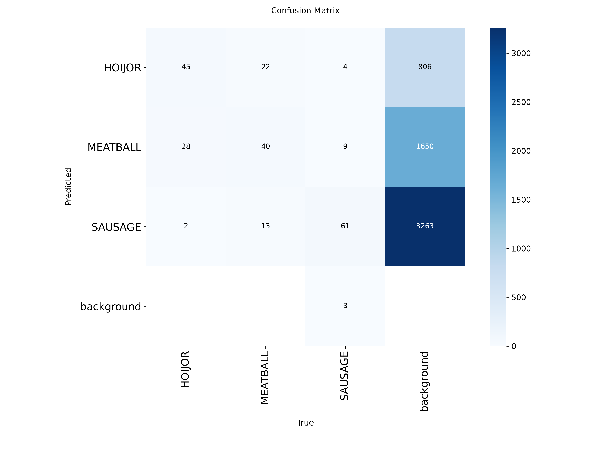
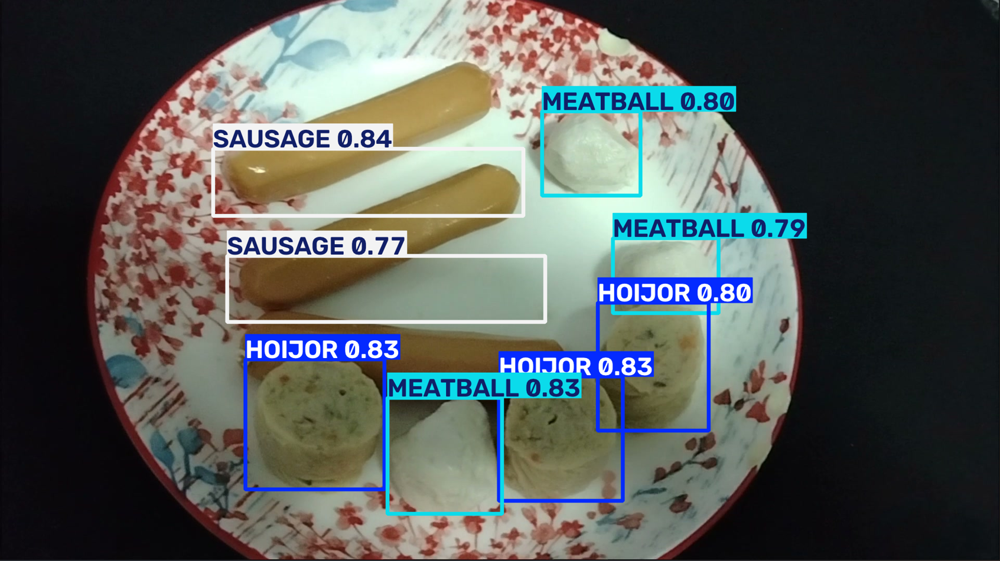
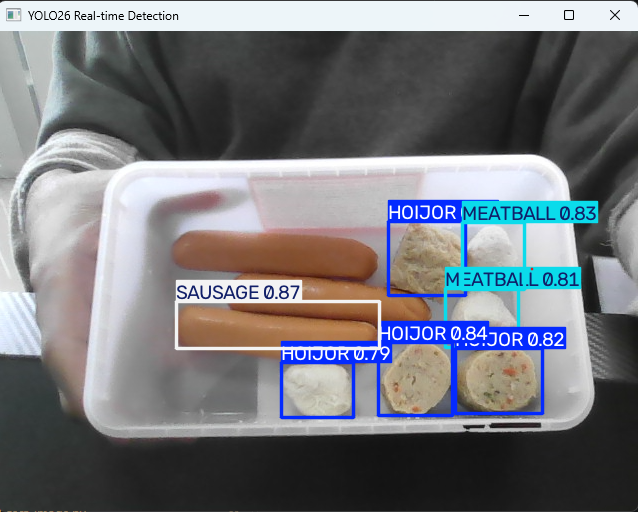

# 🍢 YOLO26 - Meatball, Sausage & Hoi Jor Detection

โปรเจกต์ **Object Detection** สำหรับตรวจจับอาหาร 3 ประเภท ได้แก่ **ลูกชิ้น (Meatball), ไส้กรอก (Sausage) และหอยจ๊อ (Hoi Jor)** โดยใช้ **YOLO26** (Ultralytics)

ระบบรองรับการตรวจจับจาก **รูปภาพ**, **วิดีโอ** และ **Webcam แบบ Real-time** ข้อมูลภาพทั้งหมดถ่ายและทำ Annotation เองด้วย Label Studio พร้อมมีโมเดลที่ผ่านการ Train แล้วในไฟล์ [`best.pt`](best.pt)

---

## 📌 Project Overview

วัตถุประสงค์ของโปรเจกต์คือสร้างโมเดล Computer Vision ที่ตรวจจับอาหาร 3 ชนิดได้จากภาพและกล้องสด โดยแบ่งออกเป็น 3 Class

| ID | Class | ความหมาย |
|---:|---|---|
| 0 | HOIJOR | หอยจ๊อ |
| 1 | MEATBALL | ลูกชิ้น |
| 2 | SAUSAGE | ไส้กรอก |

> ลำดับ ID ถูกกำหนดโดยสคริปต์ `01-export_dataset.py` (เรียงตามตัวอักษร) และบันทึกไว้ที่ `dataset/classes.txt`

---

## ✨ Features

- ตรวจจับ Meatball, Sausage และ Hoi Jor ด้วย Bounding Box
- ตรวจจับจากรูปภาพ, วิดีโอ และ Webcam แบบ Real-time
- Dataset ถ่ายและทำ Annotation เองด้วย Label Studio
- สคริปต์แปลง Label Studio JSON เป็นรูปแบบ YOLO และแบ่ง Train/Val อัตโนมัติ
- Train และ Validate ด้วย Ultralytics YOLO บน GPU
- มีโมเดลที่ Train แล้ว (`best.pt`) พร้อมใช้งาน

---

## 🧰 Technology Stack

| Technology | ใช้สำหรับ |
|---|---|
| Python 3.12 | พัฒนาโปรแกรม |
| YOLO26 (Ultralytics) | Object Detection, Training และ Inference |
| PyTorch (CUDA) | Deep Learning บน GPU |
| OpenCV | ประมวลผลภาพและ Webcam |
| Label Studio | ทำ Annotation / Bounding Box |
| FFmpeg | ตัดเฟรมจากวิดีโอ |
| Git / GitHub | จัดการเวอร์ชันและเก็บโปรเจกต์ |

**สภาพแวดล้อมที่ใช้พัฒนา:** Windows, NVIDIA GeForce RTX 4050 Laptop GPU (6 GB), Python 3.12, Ultralytics 8.4

---

## 📁 Project Structure

```text
Food-Detection-YOLO26/
│
├── dataset/                       # สร้างโดย 01-export_dataset.py
│   ├── images/
│   │   ├── train/
│   │   └── val/
│   ├── labels/
│   │   ├── train/
│   │   └── val/
│   ├── classes.txt
│   └── data.yaml
├── test/                          # ภาพทดสอบที่ตัดจากคลิปทดสอบ
├── images/                        # ภาพประกอบ README (ผลลัพธ์ / กราฟ)
├── 01-export_dataset.py           # แปลง Label Studio JSON -> YOLO format
├── 02-train.py                    # Train โมเดล
├── 03-test_image.py               # ทดสอบกับรูปภาพ
├── 04-test_video.py               # ทดสอบกับวิดีโอ
├── 05-test-camera.py              # ตรวจจับผ่าน Webcam แบบ Real-time
├── best.pt                        # โมเดลที่ Train แล้ว
├── data.yml                       # กำหนด Dataset และ Class สำหรับ YOLO
├── project-1-at-....json          # ไฟล์ Annotation ที่ Export จาก Label Studio
├── requirements.txt               # รายการ Python packages
├── yolo26n.pt                     # Pre-trained weight ตั้งต้น
├── .gitignore
└── README.md
```

### รายละเอียดไฟล์

| File / Folder | Description |
| :--- | :--- |
| `01-export_dataset.py` | อ่านไฟล์ JSON จาก Label Studio แปลงเป็น YOLO format แบ่ง Train/Val (80/20, seed 42) และสร้าง `classes.txt` กับ `data.yaml` |
| `02-train.py` | Train โมเดลด้วย Data Augmentation ที่กำหนดไว้ |
| `03-test_image.py` | ทดสอบโมเดลกับรูปภาพ และบันทึกผลลัพธ์ |
| `04-test_video.py` | ทดสอบโมเดลกับไฟล์วิดีโอ |
| `05-test-camera.py` | เปิด Webcam และตรวจจับแบบ Real-time (กด `q` เพื่อออก) |
| `best.pt` | Weight ที่ดีที่สุดจากการ Train ใช้สำหรับ Inference |
| `data.yml` | กำหนด path ของ Dataset และชื่อ Class |
| `dataset/` | Dataset ที่แปลงเป็น YOLO format แล้ว |
| `test/` | ภาพสำหรับทดสอบ (ตัดจากคลิปที่ไม่ได้ใช้ Train) |

> โฟลเดอร์ `env/`, `frame/`, `runs/` และไฟล์วิดีโอถูกกันไว้ใน `.gitignore` ไม่ได้อัปขึ้น Repository

---

## 🔄 Project Workflow

```text
   ถ่ายวิดีโอ (Webcam + มือถือ)
              │
              ▼
   ตัดเฟรมด้วย FFmpeg (2 fps)
              │
              ▼
   Label ภาพใน Label Studio
              │
              ▼
   Export JSON  ──►  01-export_dataset.py
              │
              ▼
   dataset/ + data.yml
              │
              ▼
        02-train.py
              │
              ▼
          best.pt
              │
     ┌────────┼─────────────┐
     ▼        ▼             ▼
 03-test_  04-test_     05-test-
 image.py  video.py     camera.py
 (รูปภาพ)  (วิดีโอ)     (Webcam)
```

---

## ⚙️ Installation

**1. Clone โปรเจกต์**

```bash
git clone https://github.com/Oracle-ama10/Food-Detection-YOLO26.git
cd Food-Detection-YOLO26
```

**2. สร้าง Virtual Environment (Python 3.12) และเปิดใช้งาน**

```bash
py -3.12 -m venv env
.\env\Scripts\activate.bat
```

**3. ติดตั้ง Package**

```bash
pip install torch torchvision --index-url https://download.pytorch.org/whl/cu126
pip install -U ultralytics opencv-python matplotlib label-studio
winget install ffmpeg
```

**4. ตรวจสอบว่าใช้ GPU ได้**

```bash
python -c "import torch; print(torch.cuda.is_available())"
```

ต้องแสดงผลเป็น `True`

---

## 🎥 Data Collection & Labeling

### 1) ถ่ายวิดีโอ

ถ่ายอาหารทั้ง 3 ชนิดวางปนกันบนจาน โดยแยกเป็นคลิปดังนี้

| คลิป | อุปกรณ์ | ใช้ทำอะไร |
|---|---|---|
| `video_cam.mp4` | Webcam โน้ตบุ๊ก | Train (ใกล้เคียงกับตอนใช้งานจริง) |
| `video_phone.mp4` | มือถือ | Train (เพิ่มความหลากหลายของมุมและแสง) |
| `video_test.mp4` | Webcam | ทดสอบเท่านั้น (ไม่ใช้ Train) |

### 2) ตัดเฟรม

```bash
mkdir frame\images
ffmpeg -i video_cam.mp4 -vf fps=2 frame/images/cam_%04d.jpg
ffmpeg -i video_phone.mp4 -vf fps=2 frame/images/phone_%04d.jpg
```

### 3) Label ด้วย Label Studio

ใช้ Labeling Interface แบบ Object Detection with Bounding Boxes:

```xml
<View>
  <Image name="image" value="$image"/>
  <RectangleLabels name="label" toName="image">
    <Label value="MEATBALL" background="#9f0909"/>
    <Label value="SAUSAGE" background="#FFA39E"/>
    <Label value="HOIJOR" background="#AD8B00"/>
  </RectangleLabels>
</View>
```

หลัง Label เสร็จ Export เป็น **JSON** แล้ววางไว้ในโฟลเดอร์โปรเจกต์ (โฟลเดอร์เดียวกับ `01-export_dataset.py`)

---

## 🗂️ Dataset

| รายการ | ค่า |
|---|---|
| จำนวนภาพที่ Label ทั้งหมด | `<<กรอก: เช่น 150>>` ภาพ |
| Train | `<<กรอก>>` ภาพ |
| Validation | `<<กรอก>>` ภาพ |
| อัตราส่วน Train / Val | 80 / 20 (seed = 42) |
| จำนวน Class | 3 |

แปลงข้อมูลด้วย:

```bash
python 01-export_dataset.py
```

สคริปต์จะอ่านรายชื่อ Class จากไฟล์ JSON โดยอัตโนมัติ แปลงพิกัดกรอบเป็นรูปแบบ YOLO (`class x_center y_center width height`) แล้วสร้างโฟลเดอร์ `dataset/` พร้อมไฟล์ `classes.txt` และ `data.yaml`

> หากต้องการรันสคริปต์ใหม่ ให้ลบโฟลเดอร์ `dataset/` เดิมก่อนทุกครั้ง และเหลือไฟล์ `.json` ไว้เพียงไฟล์เดียวในโฟลเดอร์

ตัวอย่าง `data.yml`:

```yaml
path: "<path ไปยังโฟลเดอร์ dataset>"
train: images/train
val: images/val

nc: 3

names:
  0: "HOIJOR"
  1: "MEATBALL"
  2: "SAUSAGE"
```

---

## 🏋️ Training

```bash
python 02-train.py
```

ค่าที่ใช้ใน `02-train.py`:

| Parameter | ค่า |
|---|---|
| โมเดลตั้งต้น | `<<กรอก: yolo26n.pt หรือ yolo26s.pt>>` |
| Epochs | 100 |
| Image size | 640 |
| Optimizer | MuSGD |
| Device | GPU (`device=0`) |
| Augmentation | `<<กรอกให้ตรงกับไฟล์ เช่น fliplr=0.5, mosaic=1.0, mixup=0.1, close_mosaic=10 (และค่า degrees / shear / perspective ที่ใช้)>>` |

ผลการ Train จะถูกบันทึกที่ `runs/detect/<ชื่อรอบ>/weights/best.pt` จากนั้น copy มาไว้ที่โฟลเดอร์หลักเป็น `best.pt`

```bash
copy runs\detect\train\weights\best.pt best.pt
```

การ Train 100 epochs บน RTX 4050 Laptop GPU ใช้เวลาประมาณ 4 นาที (รอบแรกด้วย `yolo26n.pt`)

---

## 📊 Results

### รอบแรก (v1: yolo26n, 100 epochs)

| Class | Precision | Recall | mAP50 | mAP50-95 |
|---|---:|---:|---:|---:|
| **all** | 0.838 | 0.835 | 0.853 | 0.481 |
| HOIJOR | 0.991 | 1.000 | 0.995 | 0.630 |
| MEATBALL | 0.954 | 1.000 | 0.995 | 0.572 |
| SAUSAGE | 0.570 | 0.506 | 0.569 | 0.240 |

Validation Set: 25 ภาพ, 227 กรอบ (HOIJOR 75 / MEATBALL 75 / SAUSAGE 77)

จากผลรอบแรกพบว่า **SAUSAGE** ตรวจจับได้แย่กว่า Class อื่นชัดเจน (ความมั่นใจต่ำและกรอบหลวม) จึงปรับการ Train ดังหัวข้อ Notes

### รอบล่าสุด (v2)

| Class | Precision | Recall | mAP50 | mAP50-95 |
|---|---:|---:|---:|---:|
| **all** | `<<กรอก>>` | `<<กรอก>>` | `<<กรอก>>` | `<<กรอก>>` |
| HOIJOR | `<<กรอก>>` | `<<กรอก>>` | `<<กรอก>>` | `<<กรอก>>` |
| MEATBALL | `<<กรอก>>` | `<<กรอก>>` | `<<กรอก>>` | `<<กรอก>>` |
| SAUSAGE | `<<กรอก>>` | `<<กรอก>>` | `<<กรอก>>` | `<<กรอก>>` |

### กราฟและตัวอย่างผลลัพธ์

**Confusion Matrix**



**ตัวอย่างการตรวจจับจากรูปภาพ**



**ตัวอย่างการตรวจจับผ่าน Webcam**



---

## 🧪 Testing

### ทดสอบกับรูปภาพ

แก้ชื่อไฟล์ใน `03-test_image.py` (เช่น `test/test_01.jpg`) แล้วรัน

```bash
python 03-test_image.py
```

### ทดสอบกับวิดีโอ

แก้ `video_to_test` ใน `04-test_video.py` แล้วรัน

```bash
python 04-test_video.py
```

ผลลัพธ์จะถูกบันทึกที่ `runs/detect/predict`

### ทดสอบผ่าน Webcam (Real-time)

```bash
python 05-test-camera.py
```

```text
Webcam ──► OpenCV ──► YOLO Model (GPU) ──► Bounding Box + Class + Confidence
```

| ค่า | รายละเอียด |
|---|---|
| `conf` | ค่าความมั่นใจขั้นต่ำที่จะแสดงกรอบ (ตั้ง 0.5 = แสดงเฉพาะที่เกิน 50%) |
| `device` | `0` = ใช้ GPU |
| กล้อง | `0` = กล้องตัวแรก (ถ้าเปิดไม่ได้ลองเปลี่ยนเป็น `1`) |
| ออกจากโปรแกรม | กดปุ่ม `q` |

---

## 🎬 วิธีเปิดโปรแกรมตอนสาธิต

```bash
cd Food-Detection-YOLO26
.\env\Scripts\activate.bat
python 05-test-camera.py
```

เคล็ดลับให้ตรวจจับแม่น: จัดวางอาหารให้เว้นระยะเล็กน้อย แสงสว่างพอ ไม่ย้อนแสง และเก็บของอื่นรอบจานออก

---

## 🔀 Git Workflow

| คำสั่ง | ความหมาย |
|---|---|
| `git clone <url>` | ดึง Repository จาก GitHub มาไว้ในเครื่อง |
| `git add .` | เลือกไฟล์ที่เปลี่ยนเพื่อเตรียมบันทึก |
| `git commit -m "ข้อความ"` | บันทึกเวอร์ชันลงในเครื่อง |
| `git push` | ส่งเวอร์ชันที่บันทึกขึ้น GitHub |
| `git pull` | ดึงการเปลี่ยนแปลงล่าสุดจาก GitHub ลงเครื่อง |

---

## 📝 Notes & Lessons Learned

- **SAUSAGE ตรวจจับยากกว่า Class อื่น** เพราะเป็นวัตถุยาวและวางเฉียงได้หลายมุม กรอบจึงมีพื้นที่พื้นหลังมาก และการ Augmentation แบบหมุน/บิดภาพทำให้กรอบหลวมขึ้น จึงปรับการ Train (ลดหรือปิดการหมุน/บิดภาพ) เพื่อให้กรอบแนบวัตถุมากขึ้น
- ภาพที่ใช้ Train ควรมาจาก **Webcam ตัวเดียวกับที่ใช้ตรวจจับจริง** และมีพื้นหลัง แสง และมุมกล้องใกล้เคียงกับตอนใช้งาน
- ตัวเลขใน Validation อาจดูสูงกว่าความจริง เพราะภาพ Val ตัดมาจากวิดีโอเดียวกับภาพ Train (เฟรมที่อยู่ติดกัน) การทดสอบที่เชื่อถือได้กว่าคือกล้องสดและคลิปทดสอบ (`video_test.mp4`) ที่แยกไว้
- วัตถุอื่นในฉาก (เช่น มือถือ เมาส์ มือ) อาจทำให้เกิดกรอบผิดที่ ควรเก็บออกจากภาพก่อนตรวจจับ
- ใช้ `best.pt` สำหรับ Inference

---

## 👥 ผู้จัดทำ

| ชื่อ - นามสกุล | รหัสนักศึกษา |
|---|---|
| `<<กรอก>>` | `<<กรอก>>` |
| `<<กรอก (ถ้ามีสมาชิกเพิ่ม)>>` | `<<กรอก>>` |

---

## 📚 Reference

- โครงสร้างโปรเจกต์อ้างอิงจากตัวอย่าง [Candy Detection and Classification System Using YOLO26](https://github.com/O0MlM/Candy-Detection-and-Classification-System-Using-YOLO26)
- [Ultralytics YOLO Documentation](https://docs.ultralytics.com/)
- [Label Studio](https://labelstud.io/)

---

## ✅ Project Status

**Status: Completed / Ready for Demo**

ระบบมีครบทุกขั้นตอน ตั้งแต่เตรียม Dataset, Train โมเดล, ทดสอบกับรูปภาพและวิดีโอ ไปจนถึงตรวจจับผ่าน Webcam แบบ Real-time